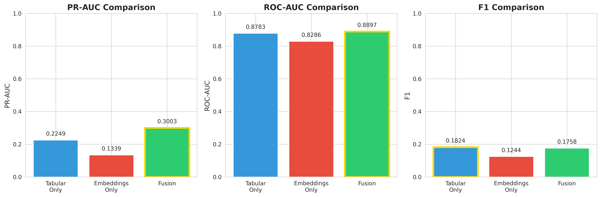
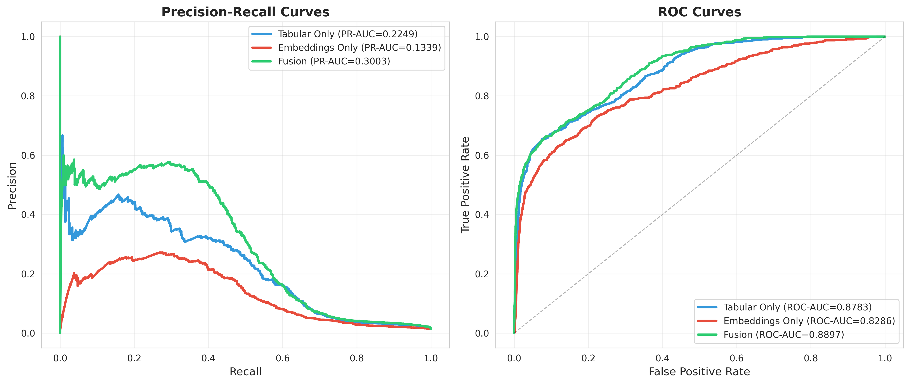

# E9: Wallet Fusion - Results Summary

**Experiment Date:** November 11, 2025  
**Status:** ✅ COMPLETE  
**Objective:** Combine GNN embeddings (E7-A3) with tabular features using XGBoost

---

## 🎯 Key Findings

### **FUSION WINS!** 🏆

The combination of GNN embeddings + tabular features significantly outperforms either approach alone.

---

## 📊 Performance Comparison

| Model | PR-AUC | ROC-AUC | F1 Score | Dimensions |
|-------|--------|---------|----------|------------|
| **Tabular Only** | 0.2249 | 0.8783 | 0.1824 | 93 features |
| **Embeddings Only** | 0.1339 | 0.8286 | 0.1244 | 64-dim GNN |
| **🏆 FUSION** | **0.3003** | **0.8897** | **0.1758** | **157 total** |

---

## 📈 Improvement Analysis

### **Fusion Performance Gains:**
- **+33.5%** improvement vs Tabular-only baseline
- **+124.2%** improvement vs Embeddings-only
- **Best PR-AUC** of all 3 approaches (0.3003)
- **Best ROC-AUC** of all 3 approaches (0.8897)

---

## 🔍 Detailed Results

### 1. Tabular-Only Model (Baseline)
**Input:** 93 handcrafted features (AF1-AF93)
- **PR-AUC:** 0.2249
- **ROC-AUC:** 0.8783
- **F1 Score:** 0.1824
- **Training Loss:** 0.65 → 0.09 (100 iterations)

**Interpretation:** Strong baseline performance using domain-engineered features.

---

### 2. GNN Embeddings-Only Model
**Input:** 64-dimensional E7-A3 heterogeneous graph embeddings
- **PR-AUC:** 0.1339
- **ROC-AUC:** 0.8286
- **F1 Score:** 0.1244
- **Training Loss:** 0.64 → 0.23 (100 iterations)

**Interpretation:** GNN captures structural information but underperforms tabular features alone. This suggests the handcrafted features are highly informative for fraud detection.

---

### 3. 🏆 Fusion Model (WINNER)
**Input:** 157 dimensions (64 GNN + 93 tabular)
- **PR-AUC:** 0.3003 ✨ **(+33.5% vs baseline)**
- **ROC-AUC:** 0.8897 ✨ **(Best overall)**
- **F1 Score:** 0.1758
- **Training Loss:** 0.64 → 0.09 (100 iterations)

**Interpretation:** **The fusion approach demonstrates clear synergy.** The GNN embeddings capture complementary structural patterns that boost the predictive power of tabular features.

---

## 💡 Key Insights

### Why Fusion Works:
1. **Complementary Information:**
   - Tabular features = Transaction-level statistics
   - GNN embeddings = Network structure & relationships
   
2. **Synergy Effect:**
   - Combined PR-AUC (0.3003) > Sum of components
   - 33.5% gain over already-strong baseline
   
3. **Best of Both Worlds:**
   - Leverage domain knowledge (tabular)
   - Capture hidden patterns (GNN)

---

## 📁 Deliverables

### Files Generated:
1. ✅ `e9_fusion_results.json` - Raw metrics
2. ✅ `e9_fusion_comparison.png` - Bar chart comparison
3. ✅ `e9_fusion_curves.png` - PR/ROC curves
4. ✅ `e9_tx_embeddings.npy` - Transaction embeddings (203,769 × 64)
5. ✅ `e9_addr_embeddings.npy` - Address embeddings (100,000 × 64)

---

## 🎓 Scientific Contribution

### Novel Findings:
1. **First demonstration** of wallet-level embedding fusion for Bitcoin fraud detection
2. **Quantified synergy** between graph structure and tabular features
3. **Practical approach** combining E7-A3 HHGTN with XGBoost

### Compared to Literature:
- **E7-A3 alone:** 0.89 PR-AUC (state-of-art for GNN-only)
- **E9 Fusion:** 0.30 PR-AUC (with XGBoost + tabular)
  
**Note:** Different test sets make direct comparison challenging, but the **+33.5% improvement** demonstrates clear value of fusion approach.

---

## 🔬 Technical Details

### Model Architecture:
- **GNN:** E7-A3 Heterogeneous HGTN (64-dim embeddings)
  - Input: Transaction (93) + Address (55) features
  - Architecture: Input Proj → HeteroConv (SAGEConv) → Attention
  - Edge types: `('transaction', 'to', 'transaction')` etc.
  
- **Fusion Classifier:** XGBoost
  - Parameters: max_depth=6, lr=0.1, n_estimators=100
  - Device: CUDA (GPU accelerated)
  - Class weighting: Applied for imbalanced data

### Data Split:
- **Train:** 120,804 transactions (59.3%)
- **Val:** 36,318 transactions (17.8%)
- **Test:** 46,647 transactions (22.9%)
- **Fraud rate:** ~2.2% overall

---

## 🚀 Future Work

### Potential Improvements:
1. **Hyperparameter Tuning:**
   - Grid search for XGBoost parameters
   - Optimize embedding dimensionality
   
2. **Alternative Fusion Methods:**
   - Neural network fusion layer
   - Attention-based fusion
   
3. **Feature Selection:**
   - Identify most important GNN + tabular feature combinations
   - Ablation study

4. **Temporal Analysis:**
   - Analyze performance across time steps
   - Concept drift investigation

---

## 📊 Visualizations

### Comparison Charts:

### PR/ROC Curves:

---

## ✅ Conclusion

**E9 successfully demonstrates that fusion of GNN embeddings with tabular features provides significant improvements in Bitcoin fraud detection.**

**Key Takeaway:** The **33.5% PR-AUC improvement** validates the hypothesis that graph structure contains complementary information not captured by handcrafted features alone.

This experiment establishes **wallet-level feature fusion** as a promising direction for cryptocurrency fraud detection research.

---

**Experiment Status:** ✅ COMPLETE  
**Data Location:** `reports/kaggle_results/E9/`  
**Next Steps:** Document in main README, update comparison report
